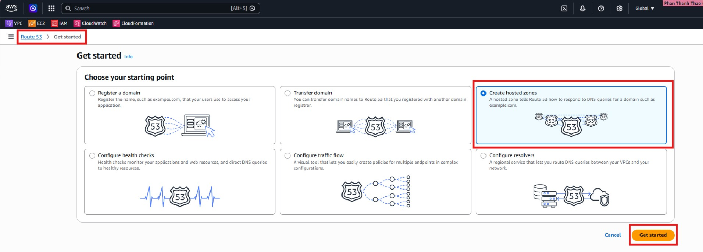
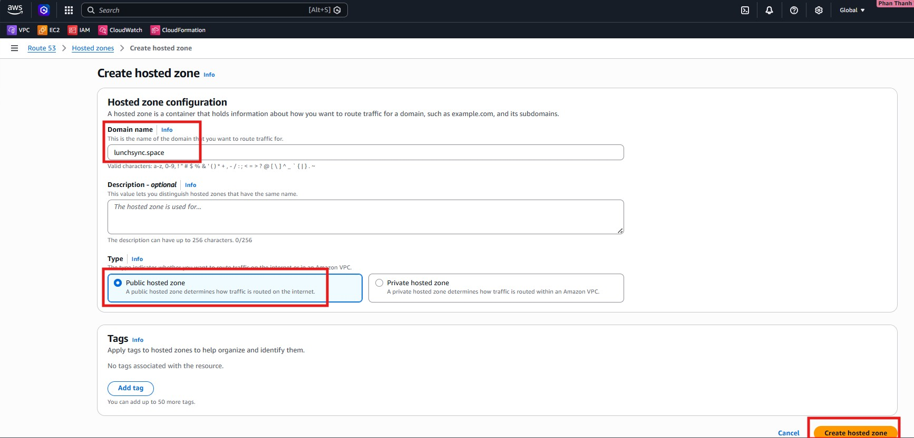
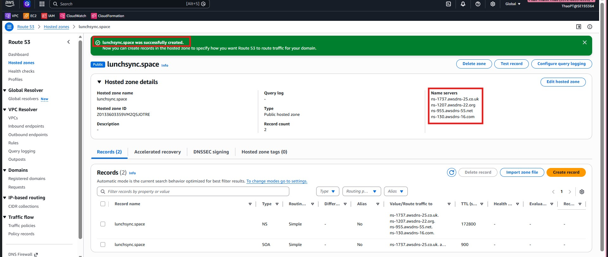
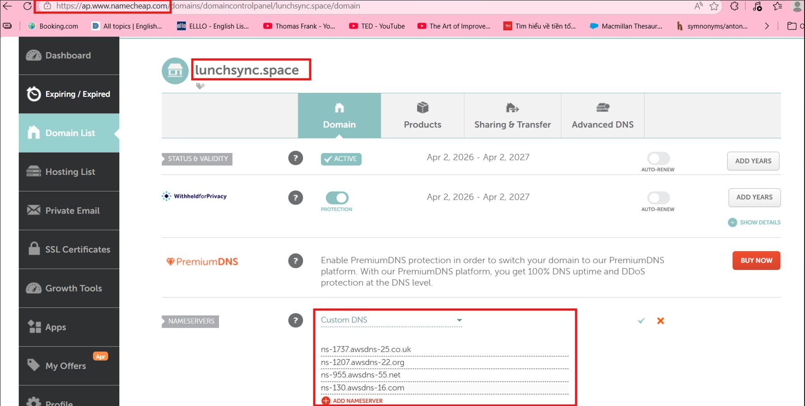

1. Open the **Route53 console** and navigate to **Hosted zones**.

2. Start creating a hosted zone for the domain or subdomain used by the application.

3. Review the generated DNS records, especially the default NS and SOA records.

4. Save the hosted zone configuration so it can be reused during certificate validation and later DNS mapping.

