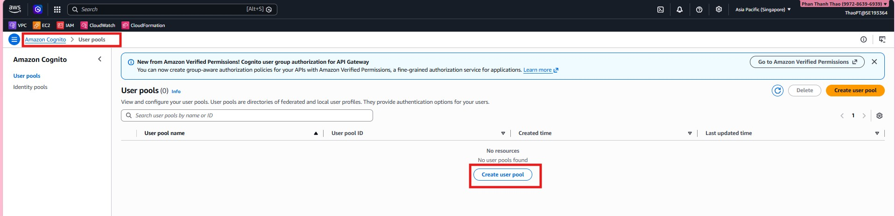

1. Mở **Amazon Cognito** console và bắt đầu tạo user pool mới.

2. Cấu hình phương thức đăng nhập và các thuộc tính người dùng chính cho ứng dụng.

3. Rà soát cấu hình user pool và hoàn tất bước tạo.

