#### Overview

This section presents the configuration steps for **S3**, **Origin Access Control**, and **CloudFront** for the static frontend.

#### Implementation steps

1. Open **Amazon S3** and start creating a new bucket for the LunchSync frontend.

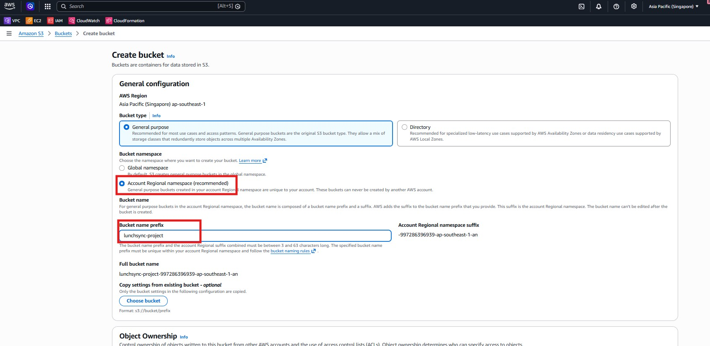

2. Set the bucket prefix to `lunchsync-project`, choose region `ap-southeast-1`, let S3 generate the full bucket name, and keep the bucket private.

3. Keep `ACLs disabled`, enable **Block all public access**, and continue with a private bucket.

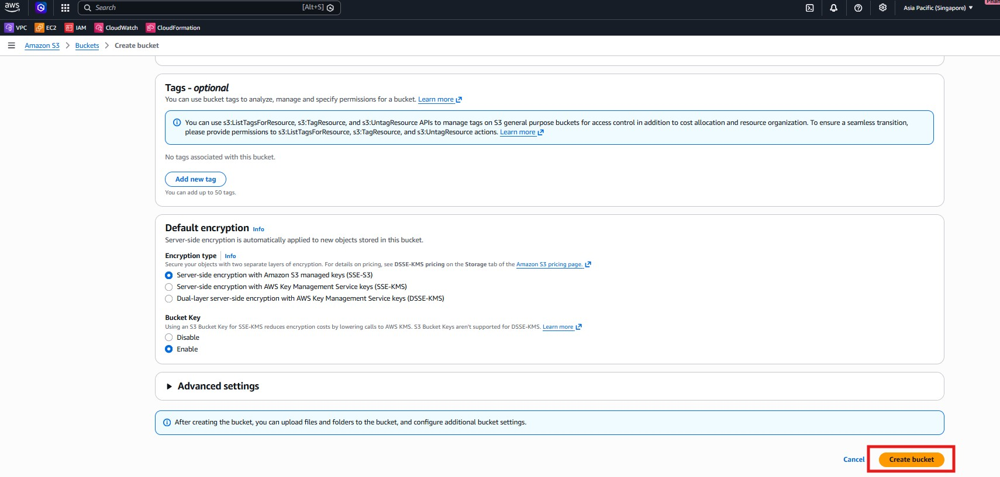

4. Keep the default `SSE-S3` encryption, create the bucket, and upload the frontend content into folders such as `frontend/` and `media/`.

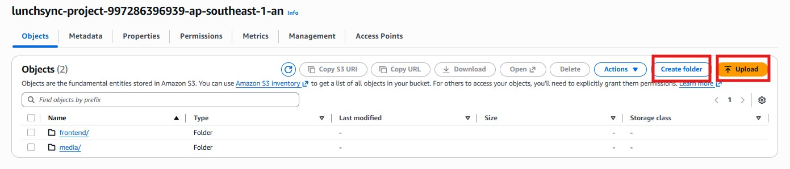

5. After the bucket is attached to CloudFront, review the **bucket policy** to make sure only `cloudfront.amazonaws.com` for this distribution can read objects.

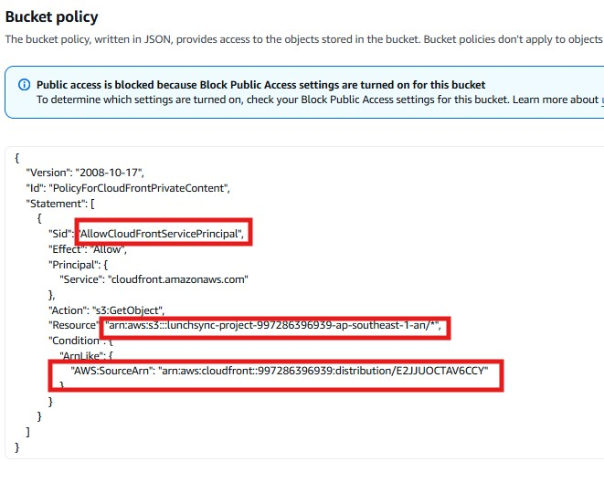

6. Move to **CloudFront > Origin access** and start creating a new **Origin Access Control** for the S3 bucket.

7. Name it `lunchsync-oac`, describe it clearly for the LunchSync bucket, and keep **Sign requests** enabled.

8. Review the OAC list to confirm `lunchsync-oac` is ready before building the distribution.

9. Open **CloudFront > Distributions** and start creating a new distribution.

10. Choose a plan and continue through the distribution wizard.

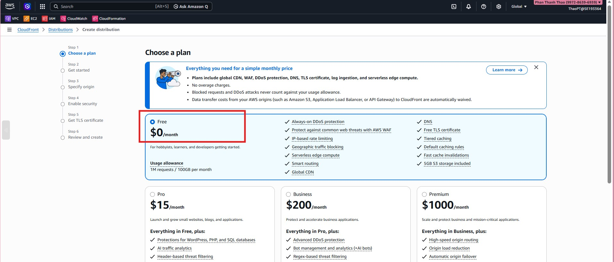

11. Name the distribution `S3-Frontend`, use **Single website or app**, and skip attaching the Route 53 domain during the initial wizard.

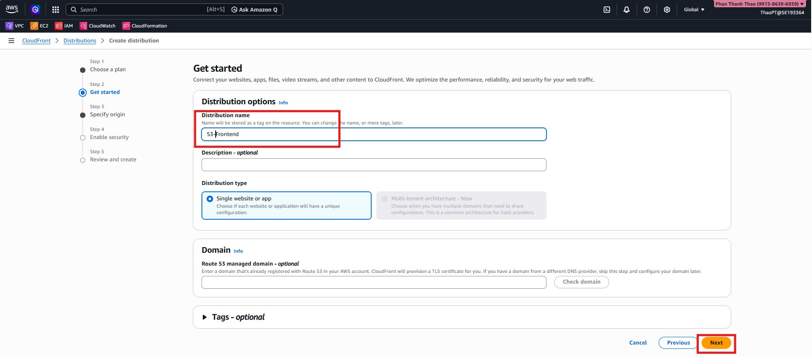

12. In **Specify origin**, choose **Amazon S3** as the origin type.

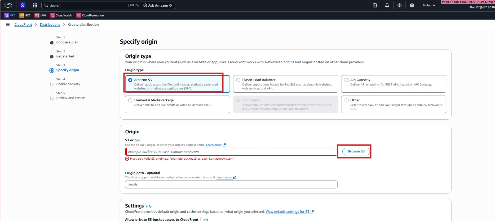

13. Select the project S3 bucket as the origin, set **Origin path** to `/frontend`, and allow CloudFront to access the private bucket.

14. Keep the AWS-recommended origin and cache settings for static content from S3.

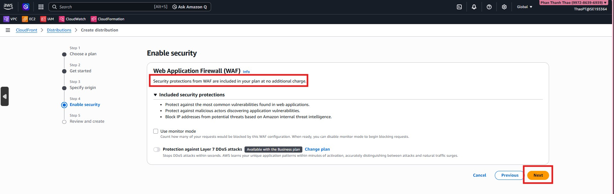

15. In **Enable security**, keep the default CloudFront/WAF protections included by the wizard.

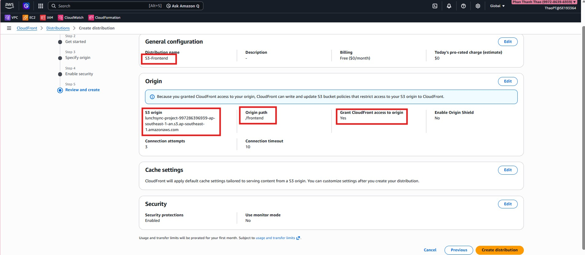

16. Review the wizard summary, confirm the S3 origin and `Origin path = /frontend`, then create the distribution.

17. After the distribution is created, open **Origins** and confirm that the first S3 origin was created with the expected origin path and OAC.

18. If needed, use **Edit origin** to reattach `lunchsync-oac` and copy the generated policy into the S3 bucket policy.

19. Open **Behaviors** and start adjusting the default behavior for the frontend.

20. For the default behavior, set **Viewer protocol policy = Redirect HTTP to HTTPS**.

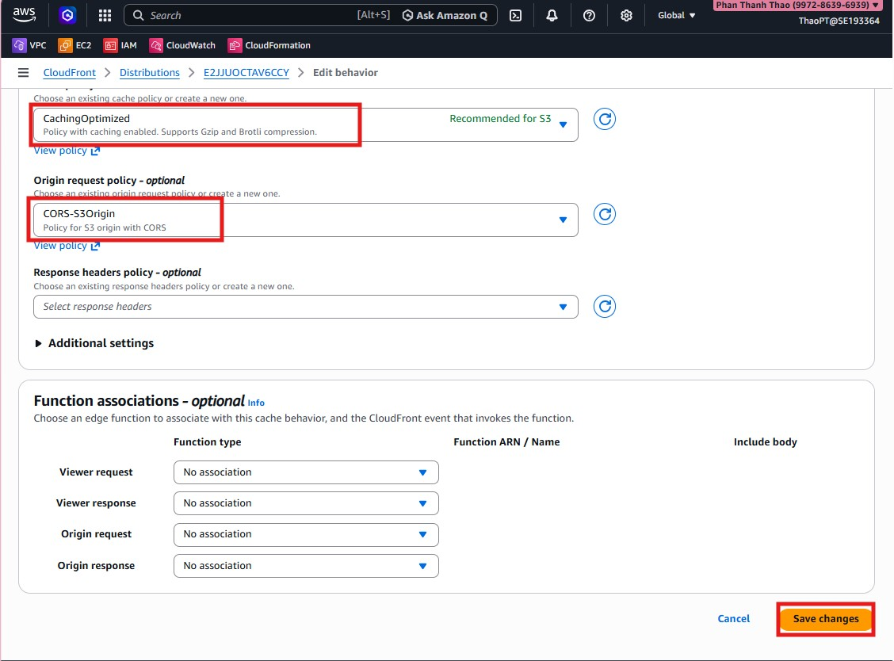

21. Keep an S3-friendly cache policy such as `CachingOptimized` together with an origin request policy like `CORS-S3Origin`.

22. Open **Error pages** and start adding a custom error response for the SPA.

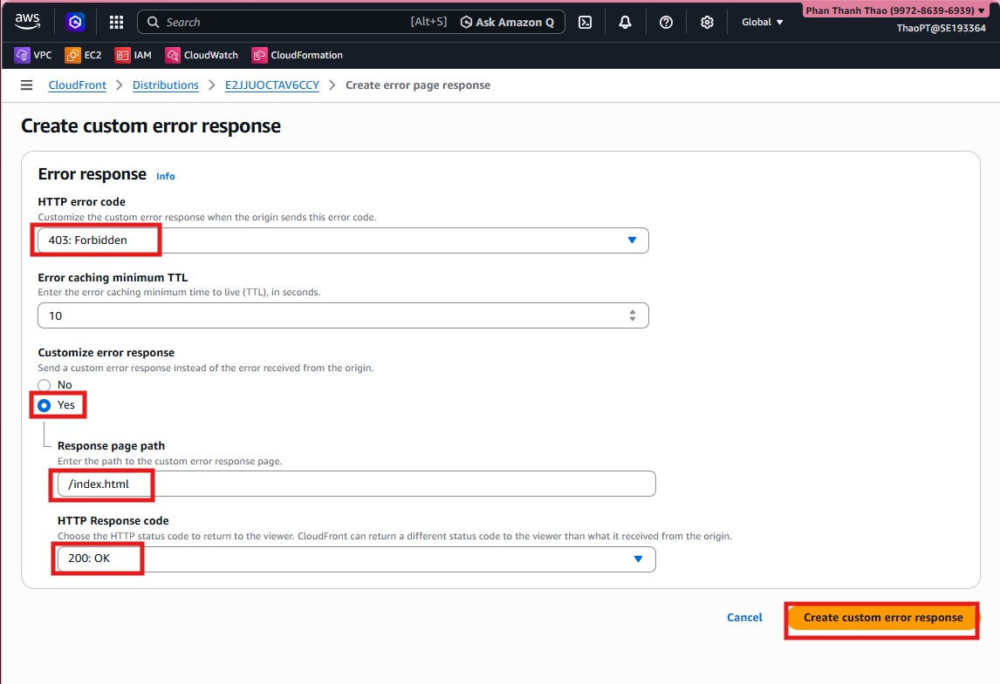

23. Create a rule so when the origin returns `403`, CloudFront responds with `/index.html` and HTTP `200` for frontend routes.

24. Review the error page list to confirm that the SPA fallback rule was saved.

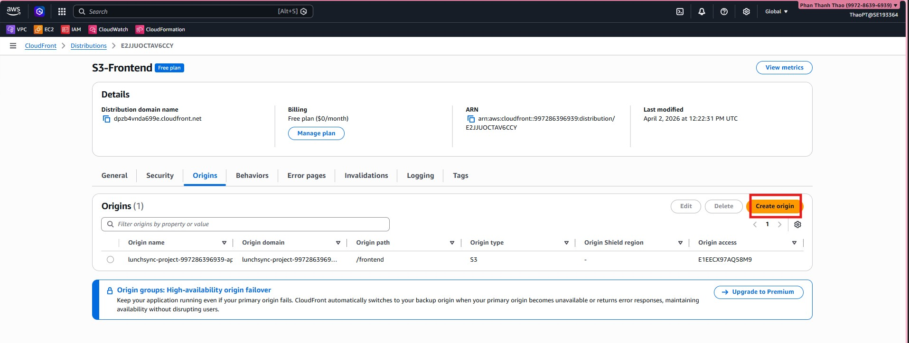

25. Return to **Origins** and create a second origin for the backend **ALB**.

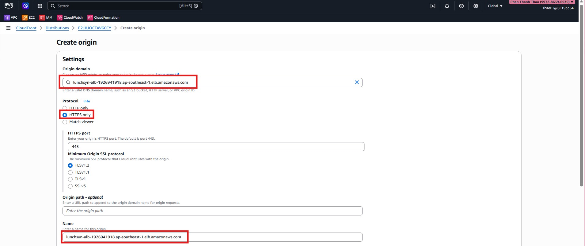

26. For the ALB origin, enter the ALB DNS name and use **HTTPS only** so CloudFront talks to the backend securely.

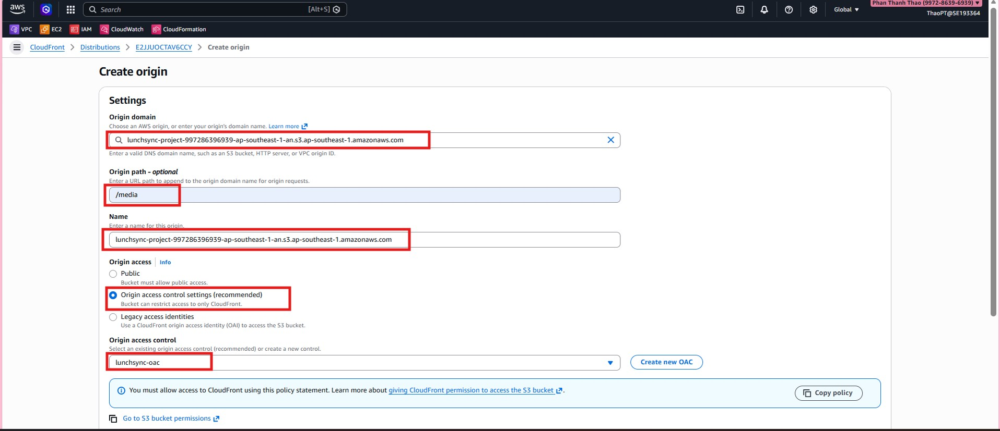

27. Create a third S3 origin for the media folder, reuse the same bucket, set **Origin path = /media**, and attach `lunchsync-oac`.

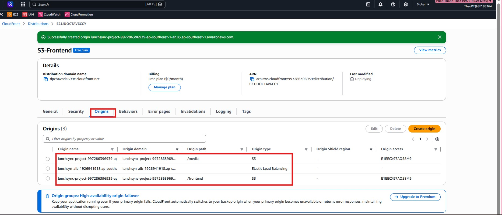

28. Review **Origins** again and confirm the distribution now has 3 origins: `frontend`, `ALB backend`, and `media`.

29. Create a new behavior for `media/*`, route it to the media S3 origin, and continue redirecting viewers to HTTPS.

30. For `media/*`, keep a static-content cache policy and avoid attaching extra functions.

31. Create the **CloudFront Function** `api-for-alb` to normalize request URIs before forwarding to the backend.

32. Create or edit a dynamic behavior such as `sessions/*` so it routes to the ALB origin, uses HTTPS only, and forwards the full viewer request.

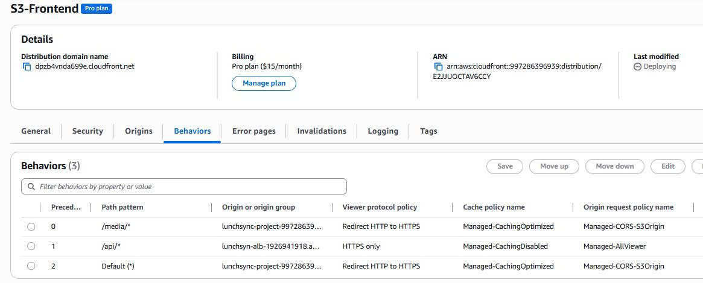

33. For dynamic ALB behaviors, use `CachingDisabled`, `AllViewer`, and attach `api-for-alb` on the **Viewer request** event.

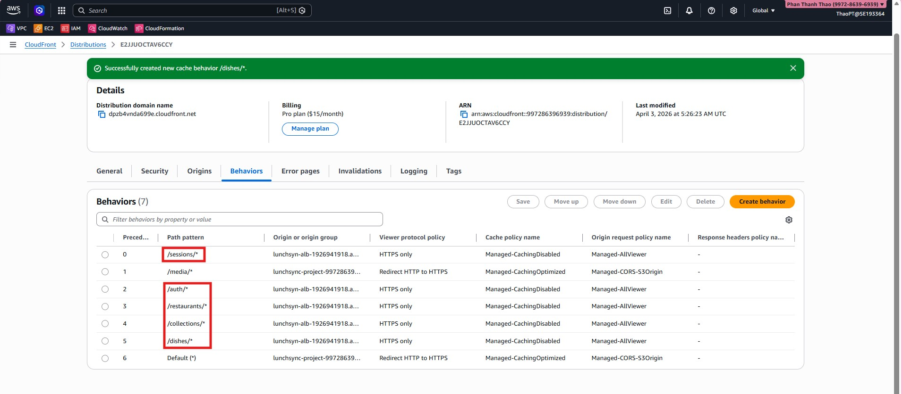

34. Review the full behavior list and confirm paths such as `/sessions/*`, `/auth/*`, `/restaurants/*`, `/collections/*`, and `/dishes/*` go to the ALB, while `Default` and `media/*` stay on S3.

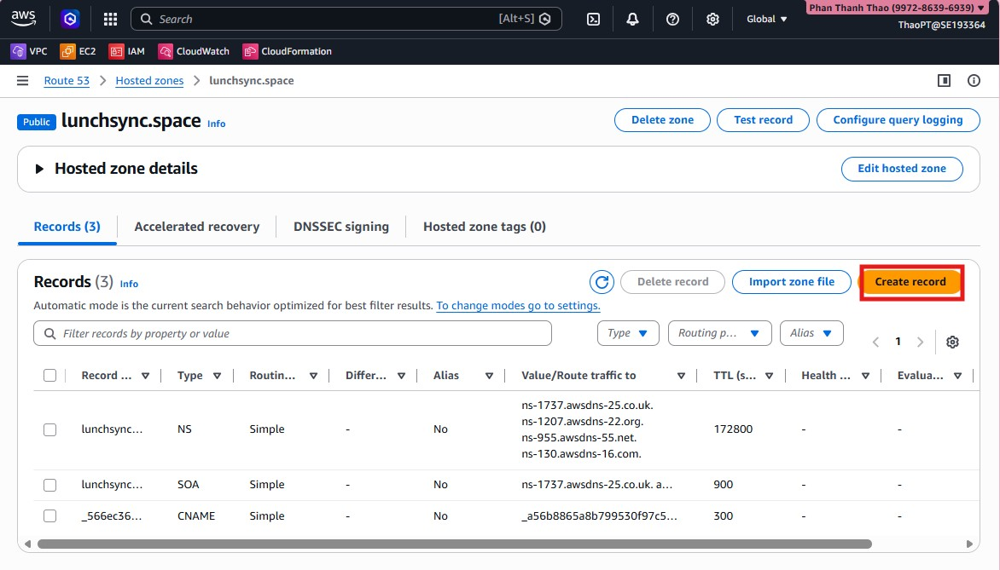

35. Switch to **Route 53**, open the `lunchsync.space` hosted zone, and prepare to add the CloudFront alias record.

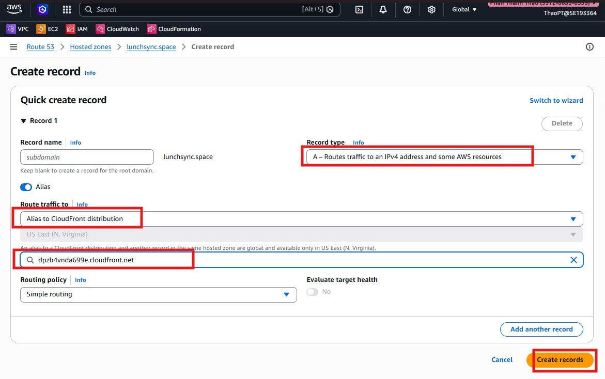

36. Create an alias record at the root domain `lunchsync.space` that points to the CloudFront distribution.

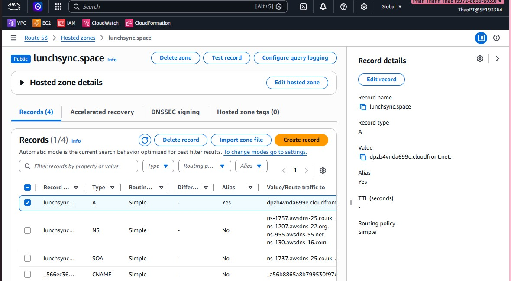

37. Review the hosted zone again and confirm the alias record to CloudFront is present.

38. Go back to **CloudFront > Edit settings**, add the **Alternate domain name (CNAME)** `lunchsync.space`, and select the ACM certificate from `us-east-1`.

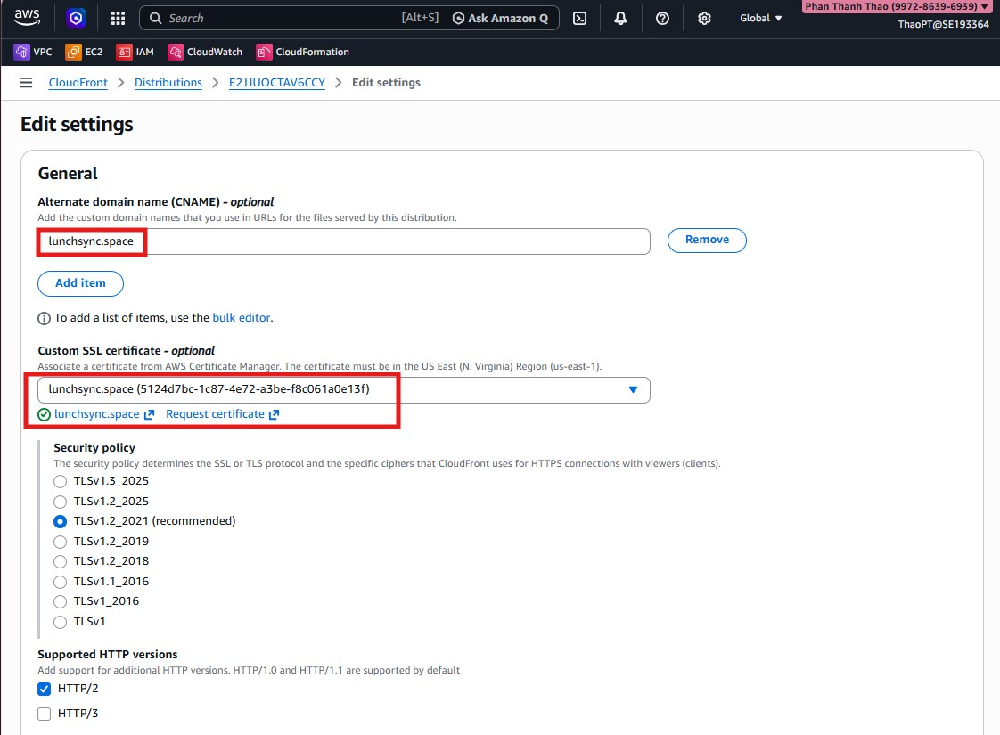

39. In the same settings page, set **Default root object = index.html** and enable the supported HTTP versions such as `HTTP/2` and `HTTP/3`.

40. Save the settings and confirm on the distribution overview page that the alias, certificate, and `index.html` default root object are applied.

41. Open `https://lunchsync.space` and confirm that the frontend is served through CloudFront with the custom domain.

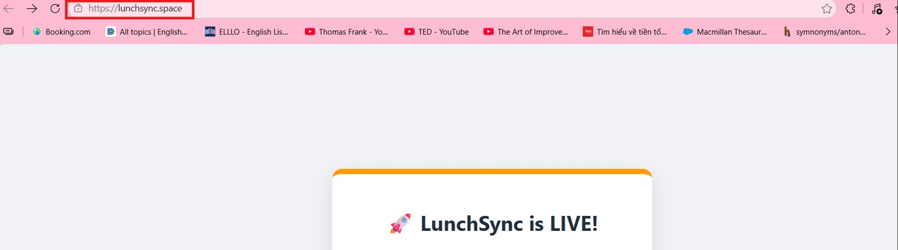

42. Test an additional asset such as `https://lunchsync.space/media/lunchsync.png` to confirm that the `media/*` behavior is also working correctly.

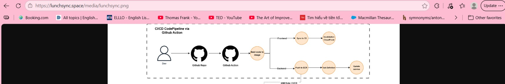
