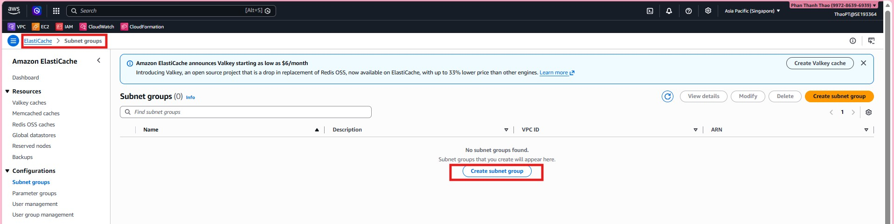
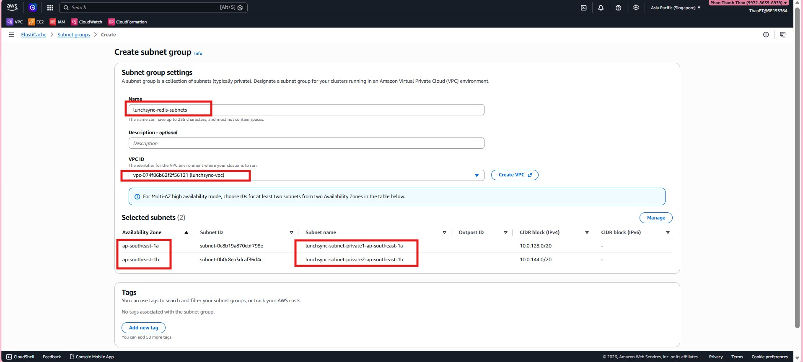
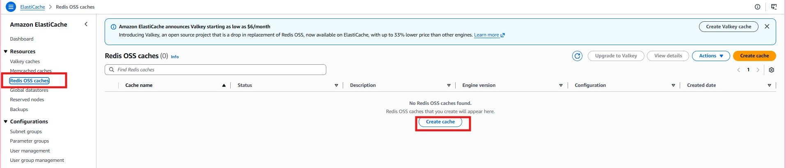
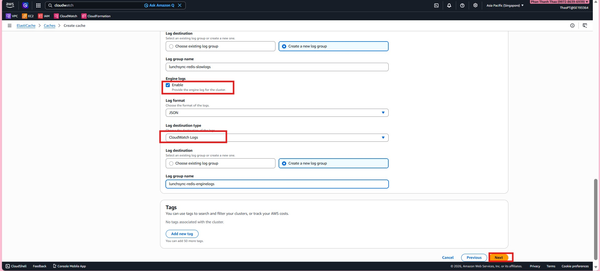
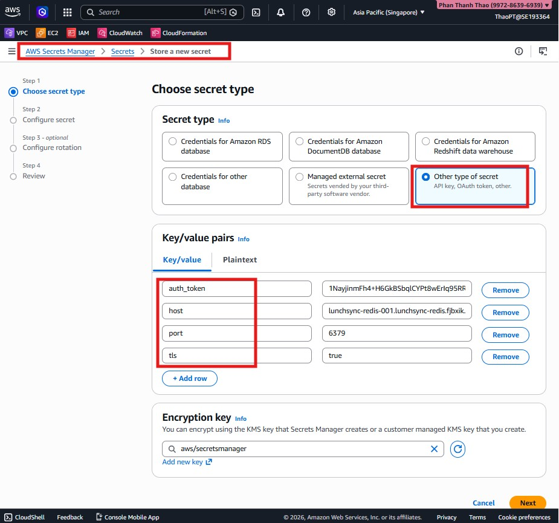
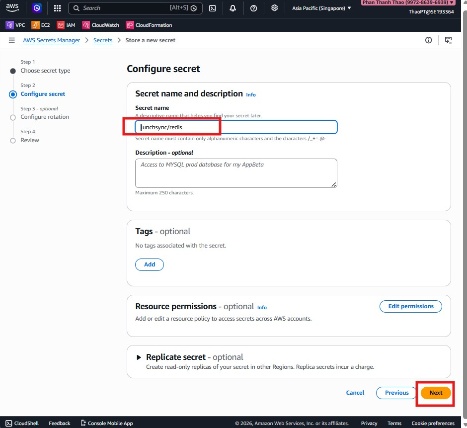
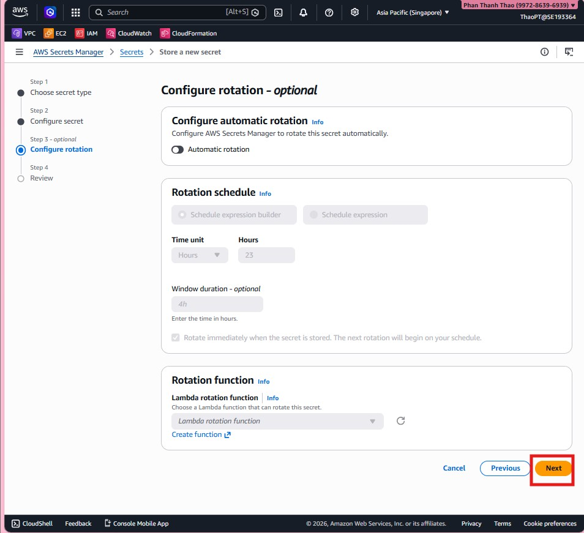
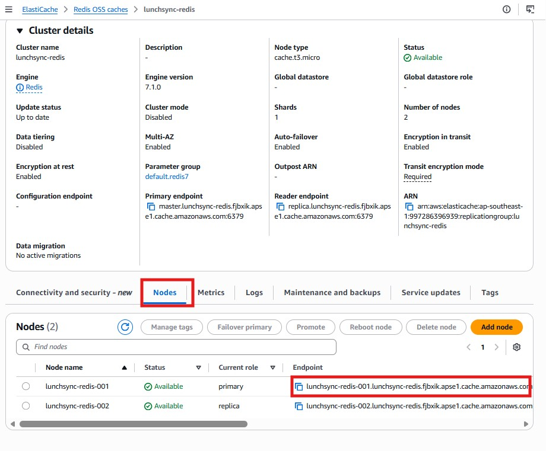

#### Overview

This section presents the steps to provision **Redis** on **ElastiCache** and configure its application integration.

#### Implementation steps

1. Before creating the cache, open **ElastiCache > Subnet groups** to create the subnet group for Redis.

2. Create `lunchsync-redis-subnets`, choose `lunchsync-vpc`, and add the two private subnets from different AZs.

3. Review the subnet group list and confirm that `lunchsync-redis-subnets` has been created.

4. Open **Redis OSS caches** and start creating a new cluster.

5. Choose **Redis OSS**, use a **Node-based cluster**, and keep **Cluster mode = Disabled**.

6. Name the cluster `lunchsync-redis`, deploy it in **AWS Cloud**, enable **Multi-AZ** and **Auto-failover**, and keep port `6379`.

7. Choose node type `cache.t3.micro` and attach the cluster to the subnet group `lunchsync-redis-subnets`.

8. Place the primary and replica in different Availability Zones so failover can work correctly.

9. In **Security**, enable **Encryption at rest**, enable **Encryption in transit = Required**, and attach security group `redis-sg`.

10. Configure backup and maintenance by enabling automatic backups, setting retention, defining a maintenance window, and enabling minor version upgrades.

11. Enable **Slow logs** and send them to CloudWatch Logs.

12. Enable **Engine logs** as well and configure the corresponding CloudWatch log group.

13. Review backup, maintenance, and logging settings before creating the cluster.

14. After the cluster becomes available, review the primary endpoint, reader endpoint, node type, and overall `Available` status.

15. If you want to harden security further, open **Modify > Security** and recheck TLS, AUTH token, and the attached security group.

16. Move to **AWS Secrets Manager**, choose **Other type of secret**, and store values such as `auth_token`, `host`, and `port` for Redis.

17. Name the secret `lunchsync/redis`.

18. Skip rotation if it is not needed yet, keep the secret static, and finish creating it.

19. Return to ElastiCache and verify the node list, primary endpoint, and reader endpoint so the backend can integrate with Redis.

