#### Tổng quan

Amazon RDS được sử dụng trong dự án như tầng cơ sở dữ liệu quan hệ. Workshop này mô tả các bước chính để tạo database instance và chuẩn bị cấu hình mạng cần thiết cho backend.

#### Các bước triển khai

1. Mở **RDS console** và bắt đầu quy trình tạo cơ sở dữ liệu.

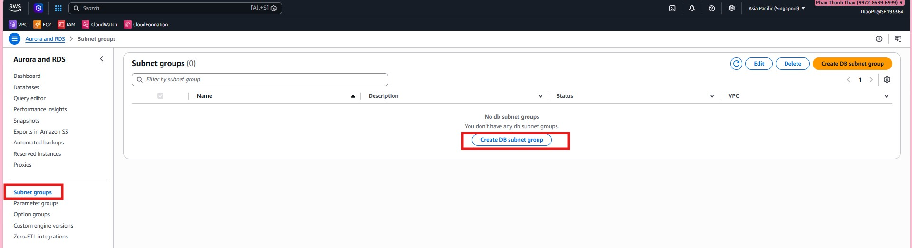

2. Xem lại màn hình khởi tạo và các lựa chọn tạo database.

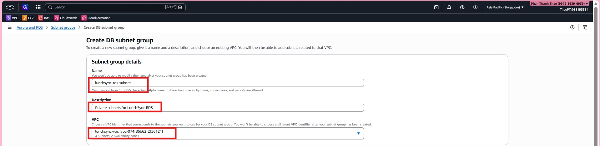

3. Chọn cách tạo database và xác nhận cấu hình engine ban đầu.

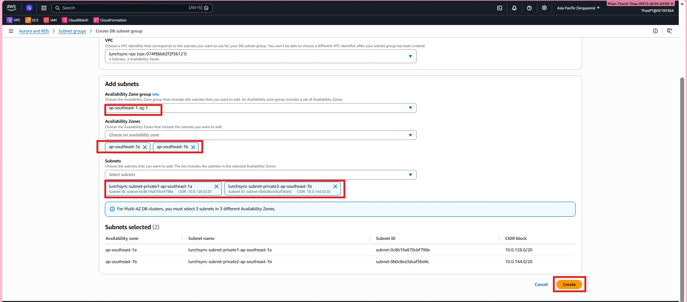

4. Chuyển sang màn hình cấu hình chi tiết cho database mới.

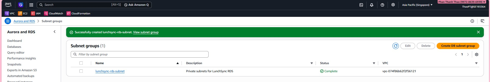

5. Chọn engine và template phù hợp với môi trường triển khai.

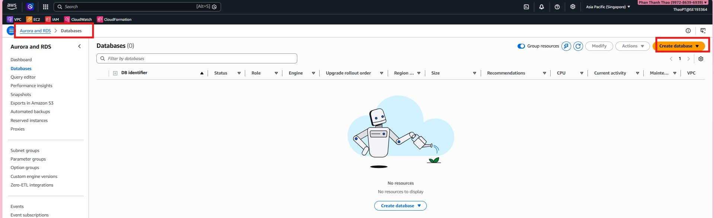

6. Cấu hình credentials, instance class, storage và availability settings.

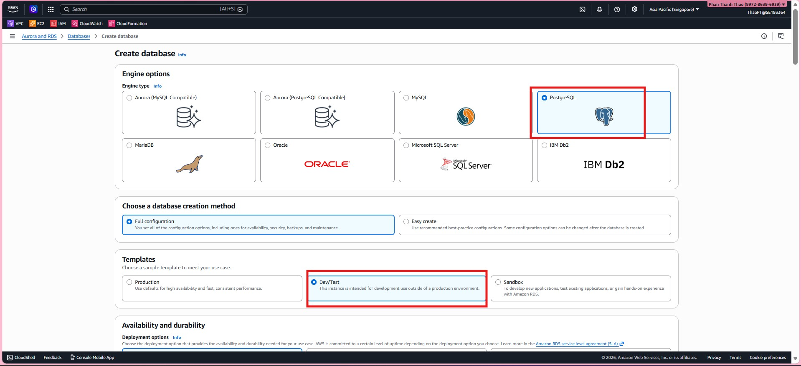

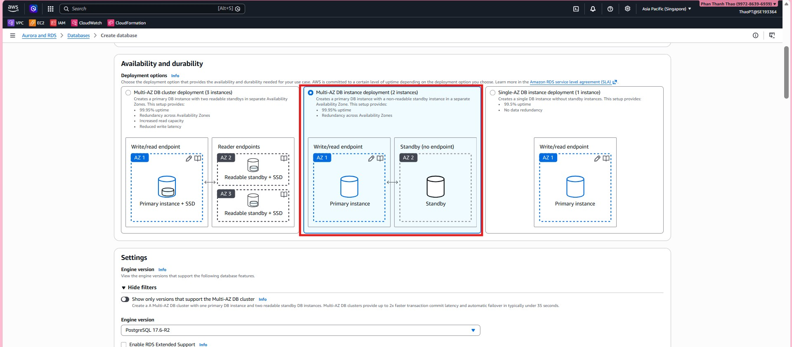

7. Cấu hình connectivity như VPC, subnet group và security groups.

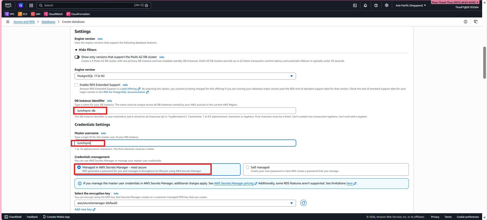

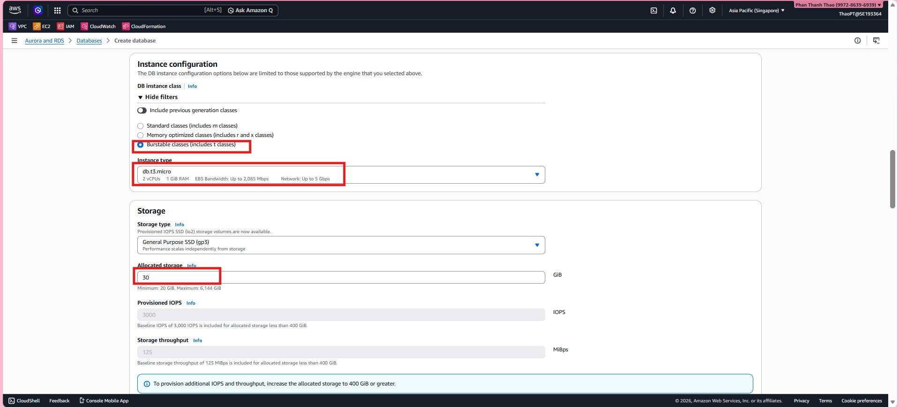

8. Thiết lập tên database và các tuỳ chọn bổ sung cần cho backend.

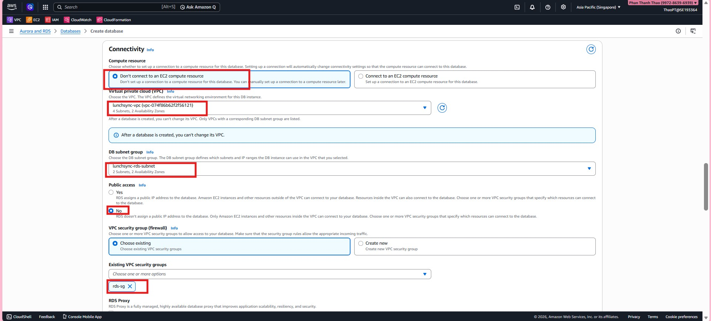

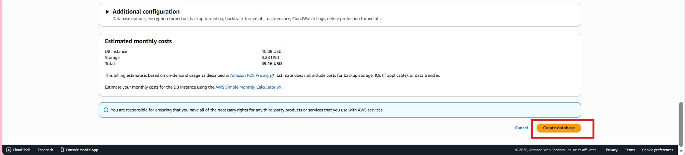

9. Rà soát cấu hình cuối cùng và tạo database instance.

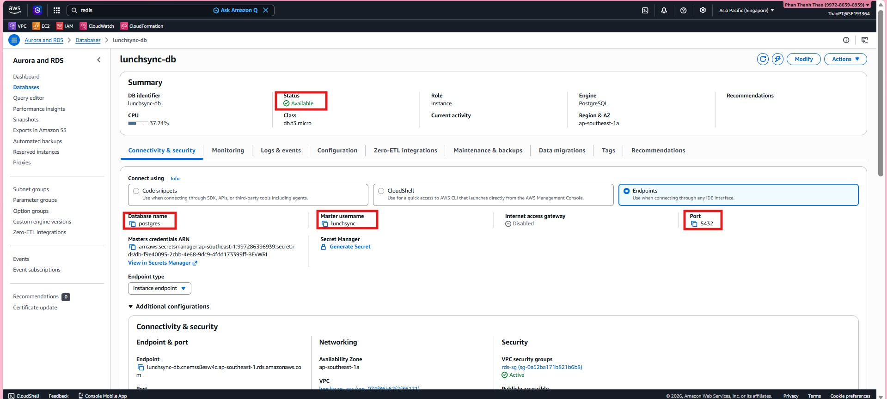

10. Kiểm tra trạng thái database và endpoint sau khi provision xong.

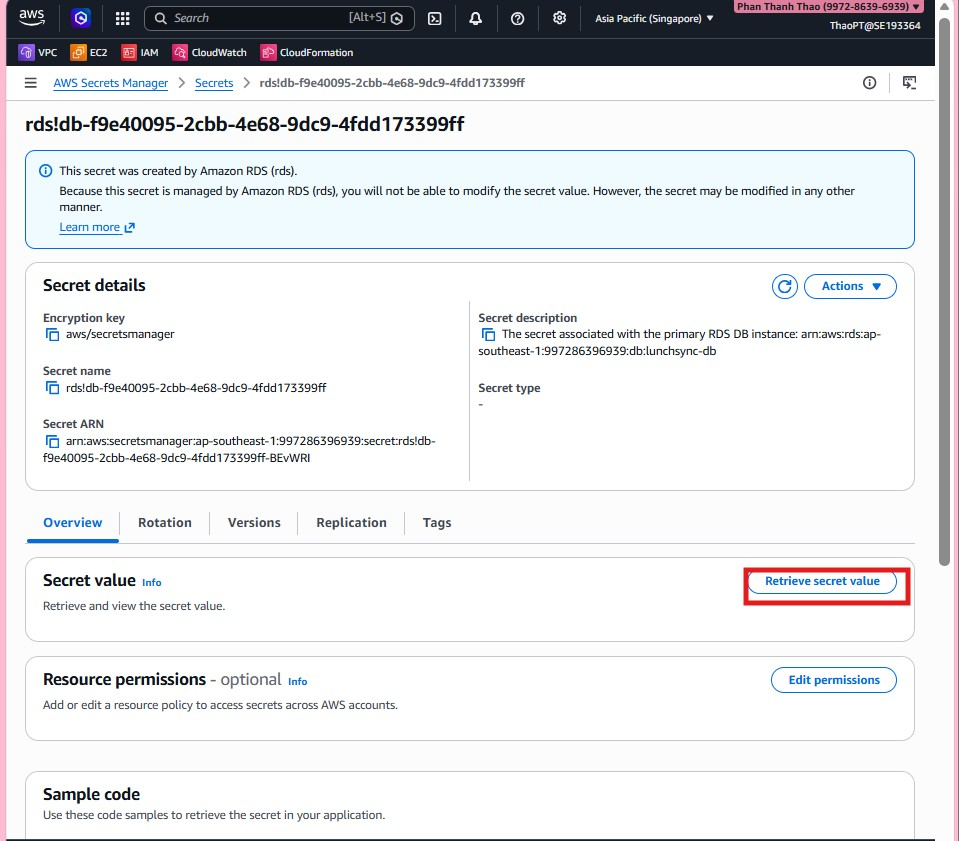
