#### Overview

Redis is used in the project as the caching layer. This workshop records the provisioning flow for the ElastiCache for Redis environment and the key settings required for integration.

#### Implementation steps

1. Open the **ElastiCache** console and choose to create a Redis deployment.

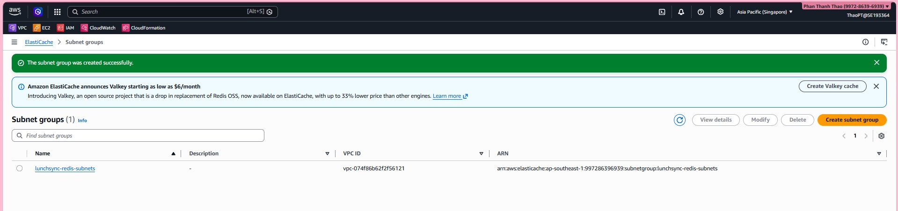

2. Enter the basic deployment settings such as cluster name and engine details.

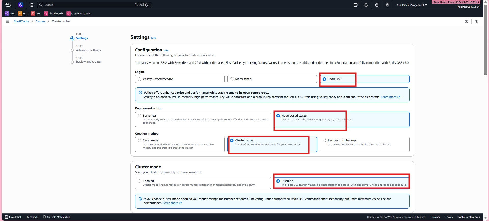

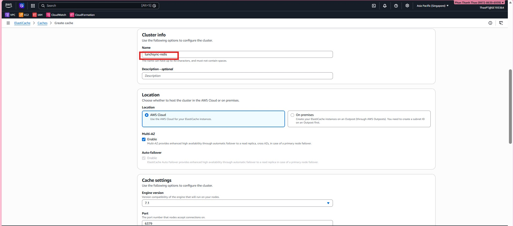

3. Configure the node layout, capacity, and availability options.

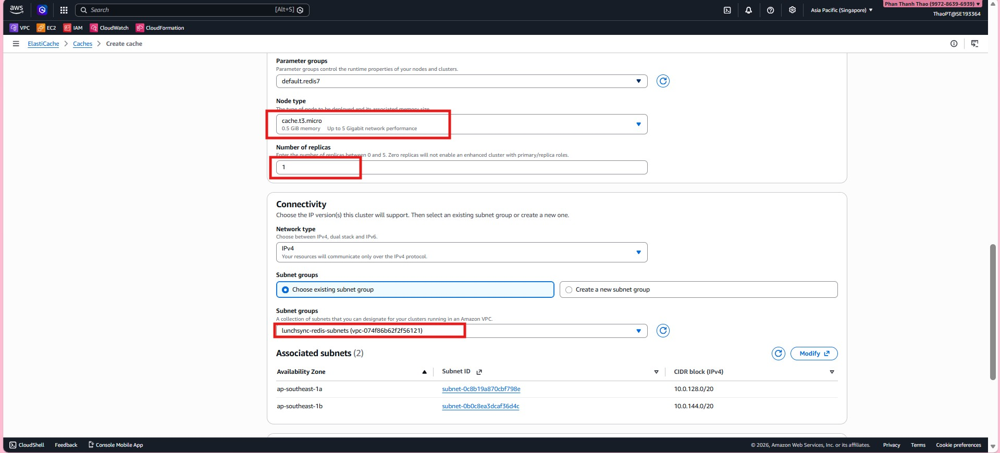

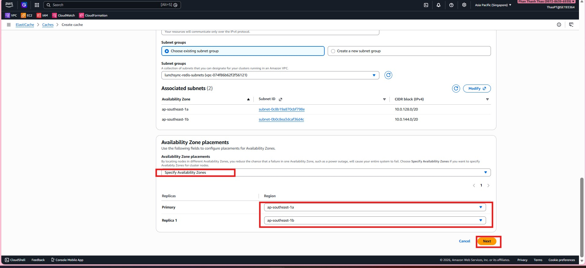

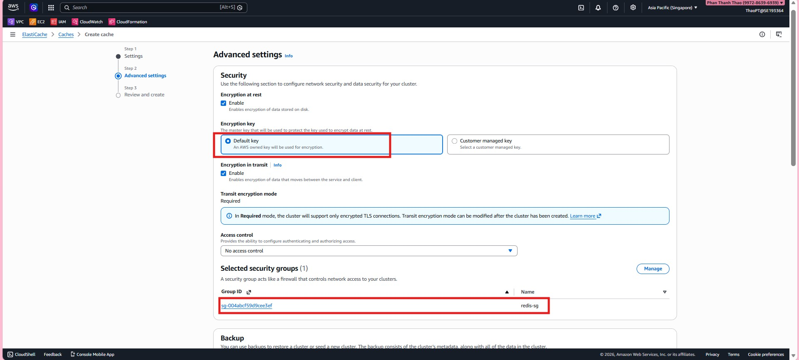

4. Configure VPC, subnet group, and security settings for the cluster.

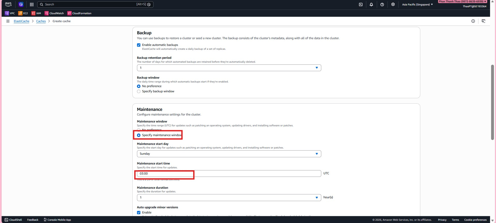

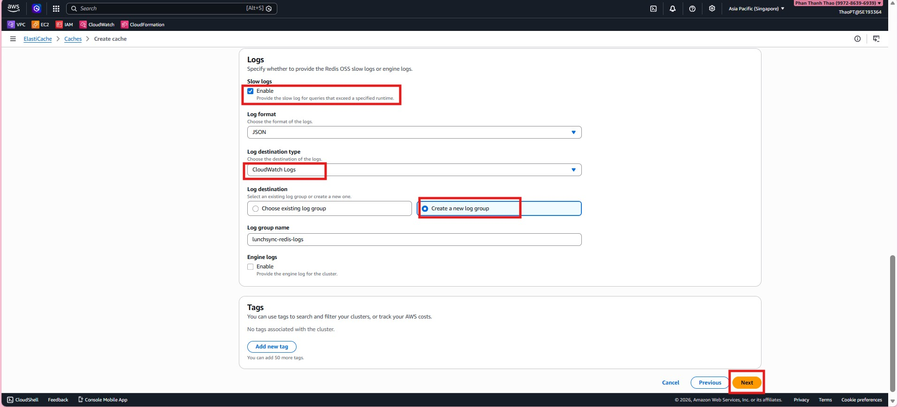

5. Review additional parameters and maintenance-related options.

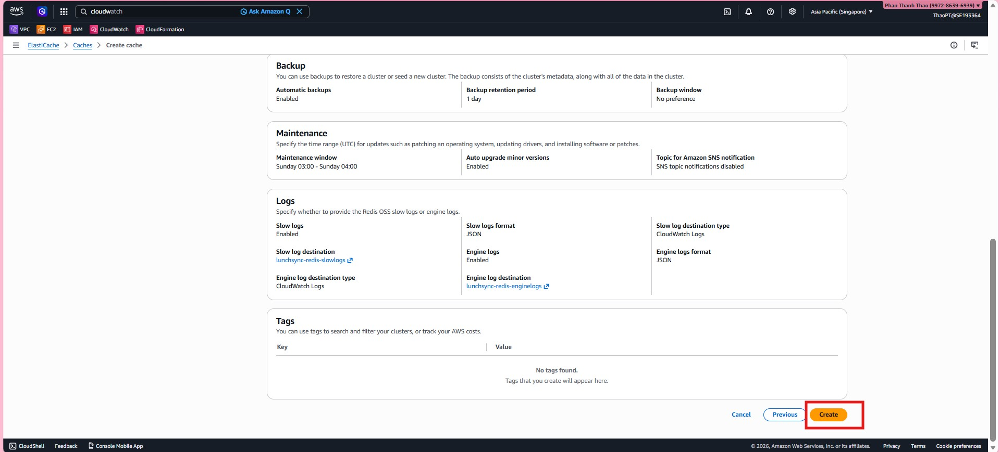

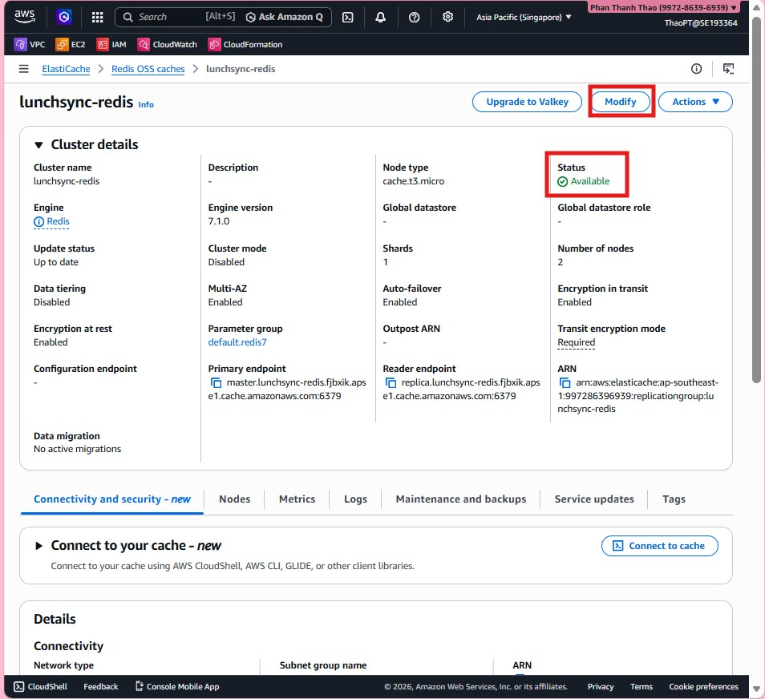

6. Review the final configuration and submit the Redis deployment.

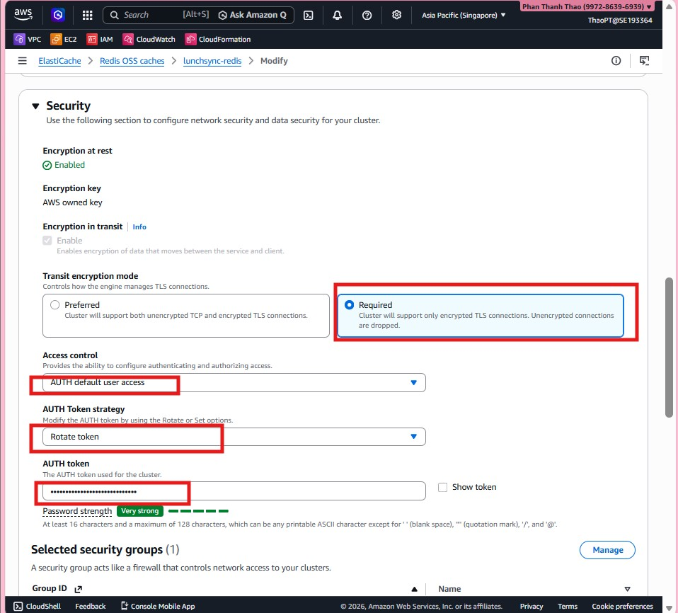

7. Wait for the cluster to become available and review its details.

8. Verify the endpoint and final Redis status for application integration.

